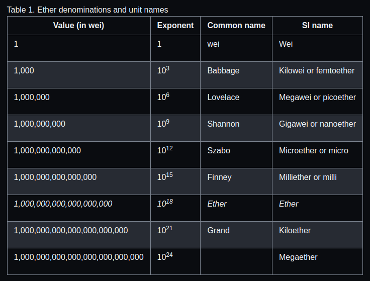

#Ethereum Basics

## Ethe units
Ether is subdivided into smaller units, down to the smallest unit possible, which is named wei. One ether is 1 quintillion wei (1 * 1018 or 1,000,000,000,000,000,000, this is to enable the transfer of ether (as value) and use (as gas) of smaller units of ether possible in the etherum system.



## wallets
Ethereum wallets only exsist to helps you manage your Ethereum account. In short, an Ethereum wallet is your gateway to the Ethereum system.

## Control and Responsibility
Ethereum is an open blockchain, this simply means that control and responsiblilty of protection your account is in your hands, if you compromise your private key, it could lead to loss of fund, so you are required to follow secure procedures to protect access to your account.

Some other blockchains manage your account for your, taking up this responsibliltes for you but either way, there are pros and cons to these, you are advised to review these pros and cons with respect to your own intest, which ever suits your current intrest you go with that.

## Ethereum as a World Computer
Ethereum functions as a decentralized world computer. Ether is  used to pay for running smart contracts, that run on an EVM.

The EVM operates as if it were a global, single-instance computer, this is possible because Each node on the Ethereum network runs a local copy of the EVM to validate contract execution, while the Ethereum blockchain records the changing state of this world computer.

## Externally Owned Accounts (EOAs) and Contracts

we have two types of account EOA and contract account.

EOA's have private keys which means control over access to funds or contracts.

A contract account has smart contract code, which a simple EOA can’t have. Furthermore, a contract account does not have a private key. Instead, it is owned (and controlled) by the logic of its smart contract code.

Contracts have addresses, just like EOAs. Contracts can also send and receive ether, just like EOAs. However, when a transaction destination is a contract address, it causes that contract to run in the EVM, using the transaction, and the transaction’s data, as its input. In addition to ether, transactions can contain data indicating which specific function in the contract to run and what parameters to pass to that function. In this way, transactions can call functions within contracts.

    NB: Solidity was created by Dr. Gavin Wood.

## A Simple Contract: A Test Ether Faucet
```solidity
// SPDX-License-Identifier: CC-BY-SA-4.0
contract Faucet {
    receive () external payable {}

    function withdraw(uint withdraw_amount) public {
        require(withdraw_amount <= 100000000000000000);
        msg.sender.transfer(withdraw_amount);
    }
}
```
This contract defined a recieve function which is triggered when ether is sent to a contact with an empty data meaning there is no specific function the transaction is directed to and there is no matching function.

The withdraw function is triggered when called with a uint value and will only execute successfully when the unit value is less than or equal to 0.1 ETH.

This is checked by the require statement in the function the allow execution to continue only if the condition is true but halts execution and reverts any change when the condition is false.

finally the sender of the transaction gets the ammount requested if the condition passed

### more on the  msg.sender and transfer in the above code
The msg object is one of the inputs that all contracts can access. It represents the transaction that triggered the execution of this contract. The attribute sender is the sender address of the transaction. The function transfer is a built-in function that transfers ether from the current contract to the address of the sender. Reading it backward, this means transfer to the sender of the msg that triggered this contract execution. The transfer function takes an amount as its only argument. We pass the withdraw_amount value that was the parameter to the withdraw function declared a few lines earlier.

    NB: Registering a contract on the blockchain involves creating a special transaction whose destination is the address 0x0000000000000000000000000000000000000000, also known as the zero address. 

    NB: Internal Transactions are also known as message. Example if such transaction is when ether transfer originates from the contract code.

## Summary
Ethereum contracts are programs that control money, which run inside a virtual machine called the EVM. They are created by a special transaction that submits their bytecode to be recorded on the blockchain. Once they are created on the blockchain, they have an Ethereum address, just like wallets. Anytime someone sends a transaction to a contract address it causes the contract to run in the EVM, with the transaction as its input. Transactions sent to contract addresses may have ether or data or both. If they contain ether, it is "deposited" to the contract balance. If they contain data, the data can specify a named function in the contract and call it, passing arguments to the function.